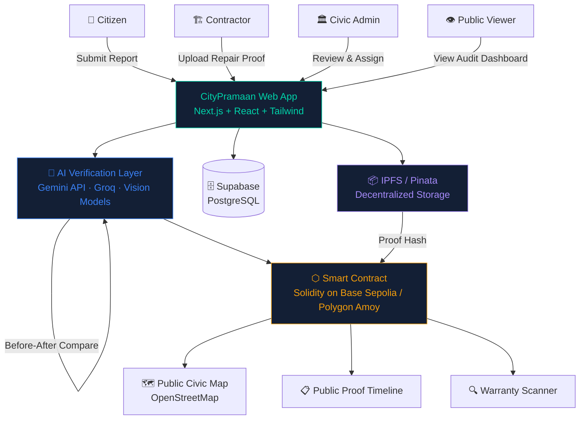

<div align="center">


[](https://git.io/typing-svg)

<br/>

[](https://nextjs.org)
[](https://soliditylang.org)
[](https://www.typescriptlang.org)
[](https://supabase.com)
[](https://ai.google.dev)
[](https://ipfs.tech)
[](https://vercel.com)

<br/>

[](https://github.com/virajkvk18/CityPramaan/stargazers)
[](https://github.com/virajkvk18/CityPramaan/forks)
[](LICENSE)
[](#)
[](#)

<br/>

> **CityPramaan** turns civic complaints into **tamper-proof, blockchain-backed public proof of repair** — making faked closures impossible and contractor negligence permanently visible.

<br/>

[🚀 Live Demo](#) · [📹 Demo Video](#) · [📊 Pitch Deck](#) · [🐛 Report Bug](https://github.com/virajkvk18/CityPramaan/issues) · [💡 Request Feature](https://github.com/virajkvk18/CityPramaan/issues)

</div>

<br/>

---

## 📋 Table of Contents

<details>
<summary>Click to expand</summary>

- [🌆 The Problem](#-the-problem)
- [💡 The Solution](#-the-solution)
- [✨ Key Features](#-key-features)
- [🔄 Proof Timeline](#-proof-timeline)
- [🏗 Architecture](#-architecture)
- [⚙ Tech Stack](#-tech-stack)
- [📜 Smart Contract](#-smart-contract)
- [📊 Platform Modules](#-platform-modules)
- [🆚 Why CityPramaan](#-why-citypramaan)
- [🌍 Real-World Impact](#-real-world-impact)
- [🚀 Getting Started](#-getting-started)
- [🔑 Environment Variables](#-environment-variables)
- [⛓ Blockchain Setup](#-blockchain-setup)
- [📁 Repository Structure](#-repository-structure)
- [🔭 Future Scope](#-future-scope)
- [👤 Author](#-author)

</details>

---

## 🌆 The Problem

<div align="center">

```
  REPORTED ──────────────────────── CLOSED
      ↑                                ↑
  (citizen files)              (admin clicks button)

         ⚠ What happened in between? Nobody knows.
```

</div>

Most civic complaint platforms operate with just **two states** — *Reported* and *Closed*. This creates a massive accountability gap:

| Pain Point | Reality |
|---|---|
| 🕳 **Fake Closures** | Complaints marked resolved with zero evidence of repair |
| 🔁 **Repeat Failures** | The same pothole refilled and broken again within days |
| 🏗 **Invisible Contractors** | No public record of who repaired what, or how well |
| 💸 **Money Drain** | Poor-quality repairs waste public funds with no accountability |
| 📵 **No Audit Trail** | Citizens cannot verify if any repair ever actually happened |

> **Cities don't just need complaint tracking. They need proof that repairs happened — and lasted.**

---

## 💡 The Solution

<div align="center">


</div>

**CityPramaan** is a **Web3 + AI civic repair accountability platform** that creates a transparent, tamper-proof proof-of-repair network for cities.

```
Citizen Reports Issue
        │
        ▼
AI Verifies Damage  ──────────────────────────►  Evidence Hash / IPFS Upload
        │                                                      │
        ▼                                                      ▼
Smart Contract Record  ◄──────────────────────  Public City Map Pin
        │
        ▼
Contractor Repair Proof
        │
        ▼
AI Before/After Comparison
        │
        ▼
Warranty Monitoring  ──────────────────────────►  Repeat Failure Detection
        │
        ▼
Public Proof Timeline  (Permanent · Auditable · Tamper-Proof)
```

---

## ✨ Key Features

<details>
<summary><b>📍 Citizen Civic Reporting</b></summary>

<br/>

Citizens can report civic issues with full context:

- 📌 **Location** — GPS-tagged map pin
- 📷 **Photo Evidence** — Before-repair image uploaded to IPFS
- 🏷 **Category** — Pothole, Drainage, Streetlight, Water Leakage, Garbage, and more
- ⚡ **Severity Level** — Low / Medium / High / Critical
- 🏙 **City & Area Details** — Ward and zone-level tagging

</details>

<details>
<summary><b>🤖 AI Damage Verification</b></summary>

<br/>

Powered by **Gemini API** and **Groq API** with open-source vision models:

- 🔍 Image-based civic damage detection
- 📊 Automated severity scoring
- 🔁 Duplicate issue detection
- 🖼 Before/After repair comparison
- 📝 AI-generated civic report summaries

</details>

<details>
<summary><b>⬡ Blockchain Proof Records</b></summary>

<br/>

Every verified civic issue becomes an **immutable on-chain record**:

- 🔗 Evidence hash stored on-chain
- ⏱ Full timestamp history
- 🏗 Contractor ID and warranty state
- 🔐 Tamper-proof status transitions
- 🔁 Repeat failure flags

Deployed on **Base Sepolia** and **Polygon Amoy** testnets.

</details>

<details>
<summary><b>🗂 IPFS-Based Evidence Storage</b></summary>

<br/>

Decentralized evidence storage via **IPFS / Pinata**:

| Evidence Type | Storage |
|---|---|
| Citizen complaint image | IPFS (Pinata pinned) |
| Before-repair photo | IPFS hash on-chain |
| Contractor after-repair photo | IPFS + proof hash |
| Geo-tagged metadata | Supabase + on-chain |

</details>

<details>
<summary><b>🏗 Contractor Accountability</b></summary>

<br/>

Contractors are tracked through every repair:

- Upload after-repair photo proof
- AI compares before and after automatically
- Warranty responsibility enforced on-chain
- Reputation score built from verified history
- Repeat failure history permanently visible

</details>

<details>
<summary><b>🔍 Warranty Breach Scanner</b></summary>

<br/>

CityPramaan introduces a **civic repair warranty system**:

If the same issue appears again near the repaired location within the warranty period, the platform **auto-flags it as a repeat failure** — exposing poor-quality repairs, contractor negligence, and high-risk civic zones.

</details>

---

## 🔄 Proof Timeline

Every civic issue moves through a **10-stage cryptographically sealed lifecycle**:

```
 ┌─────────────────────────────────────────────────────────────────────┐
 │                    CITYPRAMAAN PROOF TIMELINE                       │
 ├─────┬───────────────────────────────────────────────────────────────┤
 │  01 │  🟦  Citizen reports issue (geo-tagged photo uploaded)        │
 │  02 │  🟨  AI verifies damage (severity score generated)            │
 │  03 │  🟩  Blockchain proof record created (evidence hash on-chain) │
 │  04 │  🟦  Civic admin reviews report                               │
 │  05 │  🟨  Contractor assigned (ID recorded on-chain)               │
 │  06 │  🟦  Contractor uploads repair proof (IPFS + hash on-chain)   │
 │  07 │  🟩  AI verifies before-after repair quality                  │
 │  08 │  🟢  Warranty period starts (smart contract timer set)        │
 │  09 │  🔴  Repeat issue detected OR cleared (auto-scan)             │
 │  10 │  ✅  Public closure proof generated (permanent audit trail)   │
 └─────┴───────────────────────────────────────────────────────────────┘
```

---

## 🏗 Architecture



---

## ⚙ Tech Stack

<div align="center">

### Frontend


### Backend & Database


### Web3 & Blockchain


### AI / GenAI


### Storage & Deployment


</div>

---

## 📜 Smart Contract

The `CityPramaan` Solidity contract stores every civic proof record on-chain.

```solidity
// SPDX-License-Identifier: MIT
pragma solidity ^0.8.20;

contract CityPramaan {

    enum ReportStatus {
        Reported,               // Citizen submitted
        Verified,               // AI confirmed damage
        Assigned,               // Contractor assigned
        RepairSubmitted,        // Contractor uploaded proof
        RepairVerified,         // AI confirmed before-after
        WarrantyActive,         // Warranty timer running
        RepeatFailureDetected,  // Same issue recurred
        Closed                  // Public proof generated
    }

    struct CivicReport {
        uint256      reportId;
        string       location;
        string       issueType;
        string       evidenceHash;          // IPFS CID — complaint image
        string       repairProofHash;       // IPFS CID — after-repair photo
        address      reporter;
        address      contractor;
        uint256      createdAt;
        uint256      repairedAt;
        uint256      warrantyEndsAt;
        ReportStatus status;
        bool         repeatFailureDetected;
    }

    mapping(uint256 => CivicReport) public reports;

    event ReportCreated(uint256 indexed reportId, address reporter);
    event StatusUpdated(uint256 indexed reportId, ReportStatus newStatus);
    event RepeatFailureDetected(uint256 indexed reportId);
}
```

### Contract Status Flow

```
Reported ──► Verified ──► Assigned ──► RepairSubmitted
                                              │
                              ┌───────────────▼───────────────┐
                              │         RepairVerified         │
                              └───────────────┬───────────────┘
                                              │
                                      WarrantyActive
                                      ╱             ╲
                        RepeatFailure              Closed
                        Detected                (Proof Public)
```

---

## 📊 Platform Modules

<details>
<summary><b>1. 🏠 Citizen Portal</b></summary>

| Capability | Details |
|---|---|
| Submit civic issue | Location + photo + category + severity |
| Track complaint status | Real-time status from smart contract |
| View proof timeline | Full 10-stage audit trail |
| Map view | OpenStreetMap with issue pins |

</details>

<details>
<summary><b>2. 🤖 AI Verification Engine</b></summary>

| Capability | Model Used |
|---|---|
| Detect civic issue from image | Gemini Vision / Groq |
| Score damage severity | Vision model inference |
| Detect duplicate complaints | Embedding similarity |
| Compare before-after repair | Side-by-side vision analysis |
| Generate report summary | Gemini Flash |

</details>

<details>
<summary><b>3. 🏛 Civic Admin Dashboard</b></summary>

| Capability | Details |
|---|---|
| View city-level reports | Aggregated map + table view |
| Assign contractors | On-chain assignment transaction |
| Monitor high-risk zones | Repeat failure heatmap |
| Track repair timelines | Smart contract event history |
| Validate repair evidence | AI-assisted before/after review |

</details>

<details>
<summary><b>4. 🔧 Contractor Dashboard</b></summary>

| Capability | Details |
|---|---|
| View assigned tasks | Linked to wallet address |
| Upload after-repair proof | IPFS + on-chain hash |
| Track warranty obligations | Smart contract timer |
| Reputation score | Computed from verified repairs |

</details>

<details>
<summary><b>5. 🌐 Public Audit Dashboard</b></summary>

| Capability | Details |
|---|---|
| Map-based civic issues | All issues city-wide visible |
| Blockchain proof timeline | Immutable 10-stage record |
| Repeat failure detection | Auto-flagged on warranty breach |
| Contractor accountability | Public reputation history |

</details>

---

## 🆚 Why CityPramaan

| Feature | 🔴 Existing Apps | 🟢 CityPramaan |
|---|---|---|
| Complaint lifecycle | Stops at tracking | Full proof-of-repair lifecycle |
| Closure verification | Can be faked silently | Requires verifiable repair proof |
| Repair history | Editable / deletable | Blockchain-backed, immutable |
| Warranty tracking | None | On-chain warranty monitoring |
| Contractor accountability | Invisible | Reputation score + history |
| Public transparency | Minimal | Open civic audit dashboard |
| Evidence storage | Centralized, deletable | Decentralized IPFS + on-chain hash |
| Repeat failure detection | None | Auto-flagged by warranty scanner |

---

## 🌍 Real-World Impact

```
🔎  Radical Transparency    — Every repair step publicly visible and permanently auditable
🤝  Contractor Trust        — Reputation built on verified repair quality, not self-reports
💰  Save Public Money       — Warranty enforcement stops cheap, failing repairs
🏙  Smart City Governance   — Ward-wise civic performance and repeat failure zone analytics
🗳  Citizen Empowerment     — Anyone can verify if their complaint was actually fixed
```

**Example Use Case — Bhopal, MP Nagar Zone 1:**

> A citizen finds a pothole and submits a photo with location. CityPramaan verifies damage with AI, creates an evidence hash, stores proof on IPFS, and records the complaint on-chain. The issue appears on the public map. After repair, the contractor uploads proof. AI compares before and after. A warranty period begins. If the pothole recurs — CityPramaan flags it as a repeat failure automatically.

---

## 🚀 Getting Started

### Prerequisites

- Node.js `v18+`
- npm or yarn
- MetaMask wallet (for Web3 features)
- Supabase account
- Pinata account (IPFS)
- Gemini API key

### 1. Clone the Repository

```bash
git clone https://github.com/virajkvk18/CityPramaan.git
cd CityPramaan
```

### 2. Install Frontend Dependencies

```bash
cd web
npm install
```

### 3. Configure Environment Variables

```bash
cp .env.example .env.local
# Fill in your keys (see Environment Variables section below)
```

### 4. Run the Development Server

```bash
npm run dev
```

Open [http://localhost:3000](http://localhost:3000) in your browser.

---

## 🔑 Environment Variables

Create a `.env.local` file inside the `web/` folder:

```env
# Supabase
NEXT_PUBLIC_SUPABASE_URL=your_supabase_url
NEXT_PUBLIC_SUPABASE_ANON_KEY=your_supabase_anon_key

# Pinata / IPFS
NEXT_PUBLIC_PINATA_GATEWAY=your_pinata_gateway
PINATA_API_KEY=your_pinata_api_key
PINATA_SECRET_API_KEY=your_pinata_secret_key

# WalletConnect
NEXT_PUBLIC_WALLET_CONNECT_PROJECT_ID=your_walletconnect_id

# AI APIs
GEMINI_API_KEY=your_gemini_api_key
GROQ_API_KEY=your_groq_api_key

# Smart Contract
NEXT_PUBLIC_CONTRACT_ADDRESS=your_deployed_contract_address
NEXT_PUBLIC_CHAIN_ID=84532
```

---

## ⛓ Blockchain Setup

```bash
# Navigate to contracts folder
cd contracts
npm install

# Compile smart contracts
npx hardhat compile

# Run tests
npx hardhat test

# Deploy to Base Sepolia
npx hardhat run scripts/deploy.ts --network baseSepolia

# Deploy to Polygon Amoy
npx hardhat run scripts/deploy.ts --network polygonAmoy
```

Copy the deployed contract address into `NEXT_PUBLIC_CONTRACT_ADDRESS` in your `.env.local`.

---

## 📁 Repository Structure

```
CityPramaan/
│
├── web/                          # Next.js frontend application
│   ├── app/                      # App router pages
│   ├── components/               # Reusable UI components
│   ├── lib/                      # Utility functions & API clients
│   ├── public/                   # Static assets
│   ├── .env.local                # Environment variables (not committed)
│   ├── next.config.ts
│   ├── tailwind.config.ts
│   └── tsconfig.json
│
├── contracts/                    # Solidity smart contracts
│   ├── contracts/
│   │   └── CityPramaan.sol       # Main proof-of-repair contract
│   ├── scripts/
│   │   └── deploy.ts             # Deployment script
│   ├── test/                     # Contract test suite
│   └── hardhat.config.ts
│
├── docs/                         # Documentation
│   ├── architecture.md
│   ├── flow.md
│   └── pitch-deck.pdf
│
├── README.md
└── .gitignore
```

---

## 🔭 Future Scope

- [ ] 📡 Real GPS-based location verification
- [ ] 🏛 Live municipal complaint system integration
- [ ] 🤖 AI-powered fraud detection for fake repair proofs
- [ ] 🏆 Contractor leaderboard by city and ward
- [ ] 📊 Ward-wise civic performance score dashboard
- [ ] 🎁 Citizen reward system for verified reports
- [ ] 💬 WhatsApp complaint bot integration
- [ ] 📱 Mobile app for citizens and contractors
- [ ] 🌐 Expansion to 10+ Indian cities
- [ ] 🏙 Integration with municipal dashboards (Smart City Mission)

---

## 🏆 Hackathon Track

```
Primary Track  : Smart Cities / Civic Tech
Secondary Tracks: Web3 · Blockchain · AI / GenAI · Full-Stack
```

---

## 👤 Author

<div align="center">

**Viraj Kumar Vishwakarma**

[](https://github.com/virajkvk18)

*Building civic-tech, AI, and Web3 solutions for India.*

</div>

---

<div align="center">


**CityPramaan** — *Civic repairs should be provable, not promisable.*

⭐ Star this repo if you believe in accountable cities.

</div>
