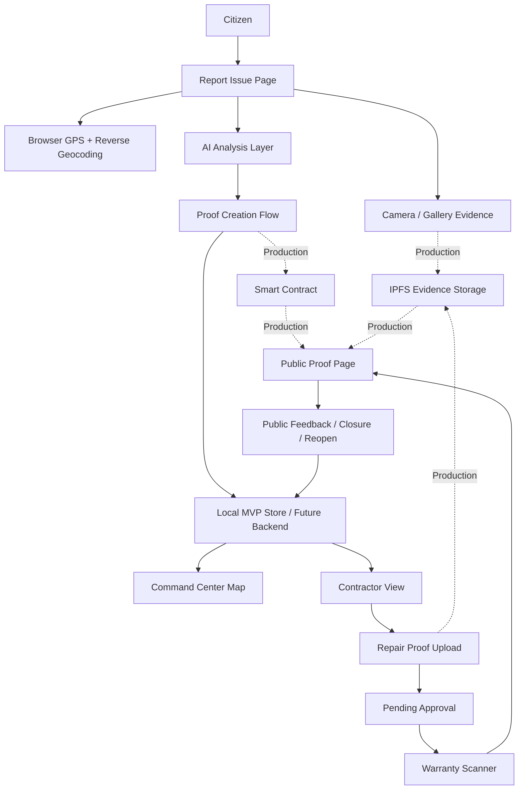

<div align="center">


[](https://git.io/typing-svg)

<br />

[](https://nextjs.org)
[](https://react.dev)
[](https://www.typescriptlang.org)
[](https://tailwindcss.com)
[](https://vercel.com)

<br />

[](#current-status)
[](#)
[](https://github.com/virajkvk18/CityPramaan/stargazers)
[](https://github.com/virajkvk18/CityPramaan/forks)

<br />

> **CityPramaan** is an AI + Web3 civic accountability platform where a public infrastructure issue is not only reported, but verified, repaired, approved, warrantied, and permanently visible as public proof.

<br />

[Live Demo](#) . [Pitch Deck](#) . [Report Bug](https://github.com/virajkvk18/CityPramaan/issues) . [Request Feature](https://github.com/virajkvk18/CityPramaan/issues)

</div>

---

## Table of Contents

- [Problem](#problem)
- [Solution](#solution)
- [Why CityPramaan Is Different](#why-citypramaan-is-different)
- [Current Status](#current-status)
- [End-to-End Workflow](#end-to-end-workflow)
- [Platform Modules](#platform-modules)
- [AI and Web3 Role](#ai-and-web3-role)
- [Architecture](#architecture)
- [Tech Stack](#tech-stack)
- [Demo Flow](#demo-flow)
- [Roadmap](#roadmap)
- [Getting Started](#getting-started)
- [Repository Structure](#repository-structure)
- [Author](#author)

---

## Problem

Most civic complaint systems stop at a weak and opaque workflow:

```text
Citizen reports issue  --->  Admin marks closed
```

The real problem is what happens between those two steps.

| Gap in existing systems | Real impact |
| --- | --- |
| No public repair proof | Citizens cannot verify whether work actually happened |
| Fake or weak closure | Issues can be marked solved without visible evidence |
| No contractor accountability | Poor repair quality is not linked to the contractor |
| No warranty memory | The same pothole, drain, or outage can repeat without a penalty trail |
| No public audit history | Citizens cannot inspect old photos, repair proof, or status updates |
| No clear restoration ETA | During power outages or storm damage, citizens do not know progress or expected restoration time |

Cities do not only need complaint tracking. They need **proof of resolution**.

---

## Solution

**CityPramaan** creates a connected proof lifecycle for civic infrastructure issues.

```text
Citizen Report
   -> AI Issue Analysis
   -> Evidence Hash / Proof Record
   -> Contractor or Utility Crew Action
   -> Repair / Restoration Proof Upload
   -> Pending Issuer Approval
   -> Warranty or Restoration Monitoring
   -> Public Proof Timeline
   -> Closure or Under-Warranty Reopen
```

Citizens can report road damage, drainage blockage, garbage blackspots, streetlight dark zones, water leakage, footpath blockage, transformer outage, feeder fault, and weather-linked power failures. Contractors or utility crews upload after-repair proof. The report issuer approves the proof. Warranty or restoration monitoring activates. The public can verify the complete history.

> Every public repair should have a public proof trail.

---

## Why CityPramaan Is Different

| Normal complaint app | CityPramaan |
| --- | --- |
| Focuses on reporting | Focuses on verified resolution |
| Closed status can be opaque | Every status change appears in a public proof timeline |
| Repair images may stay hidden | Before/after evidence is visible to the public |
| No warranty tracking | Warranty scanner tracks repeat failures |
| No contractor memory | Contractor proof and repair quality stay linked to the issue |
| Closed issue disappears | Closed issue stays in public history |
| Public cannot verify progress | Public can inspect location, proof, status, feedback, and history |
| Location is often manually vague | Real browser GPS and map coordinates are stored with reports |

---

## Current Status

The repository contains a **functional Next.js MVP** showing the full product logic using browser storage and mock proof records. It is designed to be demo-ready while still being realistic enough to upgrade into a real multi-user system.

### Working Now

- Command Center dashboard with civic issue map
- Automatic browser location permission and city detection
- City selector synced globally across pages
- Real GPS coordinates saved with reports
- Google Maps/OpenStreetMap location previews
- Mobile camera capture for live issue photos
- Image upload from gallery
- Citizen report creation with AI-style issue analysis
- Proof creation and wallet-style signing modal
- New reports sync to Command Center, Contractor View, Pending Proof, Warranty Scanner, and Public Proof
- Contractor dashboard with exact issue selection
- Contractor after-repair proof upload
- Pending Approval page for issuer review
- Warranty Scanner / Urban Ledger with repair history
- Public Proof page showing before image, after image, AI result, location, proof hash, transaction hash, timeline, warranty status, and public feedback
- Public feedback and issue closure flow
- Closed issues are removed from the active command map but remain in history
- Power outage / transformer failure flow with ETA, department, restoration stage, and citizen update
- Notifications panel linking users to issue progress
- Multilingual UI foundation for English and major Indian regional languages
- Dark/bright theme toggle
- Mobile-oriented layout improvements
- Deployed-ready Vercel setup

### MVP Data Model

The MVP currently uses:

- Mock civic records
- Browser `localStorage` for synced state
- Browser GPS for location detection
- Camera/gallery upload converted into compressed local image data
- Mock wallet/proof transactions

This keeps the MVP free to run while clearly demonstrating the intended real product workflow.

---

## End-to-End Workflow

```mermaid
flowchart LR
    A["Citizen captures issue photo"] --> B["GPS city + coordinates detected"]
    B --> C["AI analyzes issue type, severity, SLA, confidence"]
    C --> D["Citizen signs and creates proof record"]
    D --> E["Issue appears on Command Center map"]
    E --> F["Contractor selects exact issue"]
    F --> G["Contractor uploads after-repair proof"]
    G --> H["Pending Approval page"]
    H --> I["Issuer approves repair proof"]
    I --> J["Warranty activates"]
    J --> K["Public Proof timeline updates"]
    K --> L{"Issue solved?"}
    L -->|Yes| M["Issue closed and moved to public history"]
    L -->|No / repeats| N["Public raises under-warranty repeat issue"]
    N --> E
```



---

## Platform Modules

### 1. Command Center

The main city operations dashboard.

- Shows active civic issues on a map
- Uses detected city context when location permission is allowed
- Displays issue status, severity, AI confidence, SLA, and warranty state
- Opens full issue details from map pins
- Removes closed issues from the active map

### 2. Report Issue

Citizen-facing issue creation flow.

- Requests real browser location permission
- Auto-detects city and coordinates
- Supports live camera capture on mobile
- Supports gallery upload
- Runs AI-style infrastructure analysis
- Creates a blockchain-style proof record
- Syncs the report across the platform

### 3. Contractor View

Repair execution dashboard.

- Shows the latest reported issues
- Contractor selects the exact issue to repair
- Displays citizen issue image and exact location proof
- Uploads after-repair image
- Runs mock AI repair audit
- Sends proof for issuer approval

### 4. Pending Approval

Issuer review workflow.

- Shows reports waiting for approval
- Displays before image and contractor after image
- Shows repair quality signals
- Lets issuer approve repair proof
- Moves approved issues into warranty state

### 5. Warranty Scanner

Public repair warranty registry.

- Shows city-wise public issue history
- Displays pending, active, closed, and repeat failure cases
- Shows before/after proof
- Shows map location and timeline
- Supports public feedback and under-warranty repeat issue flow

### 6. Public Proof Page

The hero demo page for each issue.

- Before image
- After image
- AI verdict
- Location and coordinates
- Blockchain evidence hash
- Transaction hash
- Proof timeline
- Warranty status
- Public feedback
- Issue closure status
- City report history

---

## AI and Web3 Role

### AI Layer

In the MVP, AI behavior is simulated to demonstrate the workflow. In the production version, AI will be used for:

- Detecting issue category from uploaded image
- Estimating severity and urgency
- Generating a civic issue summary
- Comparing before and after repair images
- Detecting weak repair quality
- Tracking utility restoration progress for weather casualties and transformer failures
- Flagging repeat failures under warranty

### Blockchain / Web3 Layer

In the MVP, wallet and proof signing are demonstrated through a mock Web3 flow. In production, blockchain will be used for:

- Storing citizen evidence hash
- Storing contractor repair proof hash
- Recording timestamped status transitions
- Creating tamper-resistant public proof timelines
- Linking warranty activation and repeat failures to the same issue ID
- Making civic repair history transparent and hard to manipulate

### Why Wallet?

The wallet represents identity and signing authority.

- Citizen wallet signs report creation
- Contractor wallet signs repair proof submission
- Issuer/admin wallet signs approval and warranty activation
- Public can verify that actions came from accountable participants

---

## Architecture



---

## Tech Stack

### Current MVP

| Layer | Technology |
| --- | --- |
| Frontend | Next.js 16, React 19, TypeScript |
| Styling | Tailwind CSS, custom glassmorphism UI, responsive layouts |
| Icons | Lucide React |
| Maps | OpenStreetMap embed, Google Maps links, GPS coordinates |
| Location | Browser Geolocation API, reverse geocoding |
| Media | Camera capture, gallery upload, browser-side image compression |
| State | Browser localStorage + React sync stores |
| Deployment | Vercel |

### Planned Production Integrations

| Layer | Suggested Tooling |
| --- | --- |
| Smart contracts | Solidity, Hardhat, OpenZeppelin |
| Testnet | Polygon Amoy or Base Sepolia |
| Wallet | wagmi, RainbowKit, MetaMask |
| Evidence storage | IPFS / Pinata |
| Database | Supabase PostgreSQL |
| AI vision | Gemini Vision / Groq / open-source classifier |
| Maps | Google Maps API or advanced OpenStreetMap workflow |

---

## Demo Flow

Use this sequence during a pitch/demo:

1. Open the **Command Center** and allow location permission.
2. Show that the dashboard city updates from browser GPS.
3. Create a new report from **Report Issue** using camera capture and GPS.
4. Return to the **Command Center** and show the report on the active map.
5. Open **Contractor View**, select the exact issue, and upload after-repair proof.
6. Open **Pending Approval** and approve the contractor proof.
7. Open **Warranty Scanner** and show warranty activation.
8. Open the **Public Proof** page and show before/after images, AI result, hash, transaction, timeline, warranty, and feedback.
9. Add public feedback or raise an under-warranty repeat issue.
10. Close the issue and show that it leaves the active map but remains in public history.

---

## Roadmap

- Real AI image detection for potholes, drainage, garbage, streetlight dark zones, water leakage, footpath blockage, and power outage evidence
- Real smart contract deployment for report creation, repair proof, approval, warranty, and repeat failure events
- IPFS upload for citizen and contractor images
- Supabase backend for persistent multi-user data
- Wallet-based roles for citizen, contractor, issuer, and public verifier
- Contractor reputation scoring
- Ward-level repair quality analytics
- Admin dashboard for municipal teams
- WhatsApp/mobile-first reporting interface
- Real-time notification system
- Open civic data dashboard for city performance

---

## Getting Started

### Prerequisites

- Node.js 18+
- npm

### Clone

```bash
git clone https://github.com/virajkvk18/CityPramaan.git
cd CityPramaan
```

### Install and Run

```bash
cd web
npm install
cp .env.example .env.local
npm run dev
```

Open:

```text
http://localhost:3000
```

For Supabase-backed auth and report storage, add your Supabase URL, anon key,
and service-role key to `web/.env.local`, then run the SQL files in
`web/supabase/migrations` inside the Supabase SQL editor.

### Production Build

```bash
cd web
npm run lint
npm run build
```

---

## Repository Structure

```text
CityPramaan/
  contracts/
    .gitkeep
  docs/
  web/
    app/
      about/
      contractor/
      pending/
      proof/[id]/
      report/
      warranty/
      page.tsx
      layout.tsx
      globals.css
    src/
      components/
        layout/
        map/
        proof/
      lib/
        city-context.ts
        city-storage.ts
        detected-location-storage.ts
        infrastructure-analyzer.ts
        language-context.ts
        mock-data.ts
        report-storage.ts
        use-detected-location.ts
        wallet-storage.ts
    public/
    package.json
    tsconfig.json
  README.md
```

---

## Project Pitch

**CityPramaan is not just a complaint app.** It is a proof-of-repair network for cities.

It solves the accountability gap after a civic issue is reported by making every important step visible:

```text
Report -> AI Verify -> Proof -> Repair -> Approval -> Warranty -> Public History
```

This makes it useful for citizens, contractors, issuers, city officials, and the general public.

---

## Author

<div align="center">

**Viraj Kumar Vishwakarma**

[](https://github.com/virajkvk18)

Building civic-tech, AI, and Web3 solutions for accountable cities.

</div>

---

<div align="center">


**CityPramaan** - Civic repairs should be provable, not promisable.

</div>
