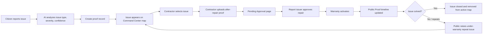
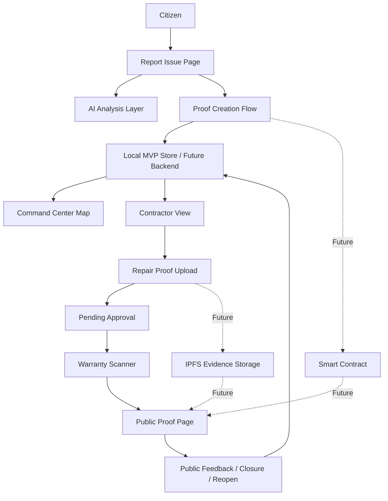

<div align="center">


[](https://git.io/typing-svg)

<br />

[](https://nextjs.org)
[](https://react.dev)
[](https://www.typescriptlang.org)
[](https://tailwindcss.com)
[](https://vercel.com)

<br />

[](#current-mvp-status)
[](#)
[](https://github.com/virajkvk18/CityPramaan/stargazers)
[](https://github.com/virajkvk18/CityPramaan/forks)

<br />

> **CityPramaan** is an AI + Web3 civic accountability platform where a public infrastructure issue is not just reported. It is verified, repaired, approved, warrantied, and permanently visible as public proof.

<br />

[Live Demo](#) . [Pitch Deck](#) . [Report Bug](https://github.com/virajkvk18/CityPramaan/issues) . [Request Feature](https://github.com/virajkvk18/CityPramaan/issues)

</div>

---

## Table of Contents

- [The Problem](#the-problem)
- [The Solution](#the-solution)
- [What Makes CityPramaan Different](#what-makes-citypramaan-different)
- [Current MVP Status](#current-mvp-status)
- [Core Workflow](#core-workflow)
- [Platform Modules](#platform-modules)
- [AI and Web3 Role](#ai-and-web3-role)
- [Architecture](#architecture)
- [Tech Stack](#tech-stack)
- [MVP Demo Flow](#mvp-demo-flow)
- [Future Production Roadmap](#future-production-roadmap)
- [Getting Started](#getting-started)
- [Repository Structure](#repository-structure)
- [Author](#author)

---

## The Problem

Most civic complaint systems stop at a weak flow:

```text
Citizen reports issue  --->  Admin marks closed
```

The real problem is the missing proof between those two steps.

| Gap in existing systems | What happens in reality |
| --- | --- |
| No public repair proof | Citizens cannot verify if the work was actually done |
| Fake or weak closure | Issues can be marked solved without visible evidence |
| No contractor accountability | The contractor's repair quality is not publicly traceable |
| No warranty memory | The same pothole or drainage issue can fail again with no penalty trail |
| No public audit history | Past reports, repair photos, and status changes are not easy to verify |

Cities do not only need complaint tracking. They need **proof of resolution**.

---

## The Solution

**CityPramaan** creates a connected proof lifecycle for civic infrastructure issues.

```text
Citizen Report
   -> AI Issue Analysis
   -> Evidence Hash / Blockchain Proof
   -> Contractor Repair Proof
   -> Pending Issuer Approval
   -> Warranty Activation
   -> Public Proof Timeline
   -> Closure or Under-Warranty Reopen
```

Citizens can report infrastructure issues such as road damage, drainage blockage, garbage blackspots, streetlight dark zones, transformer outages, weather-linked power failures, water leakage, and footpath damage. Contractors or utility crews upload after-repair/restoration proof. The report issuer approves the proof. Warranty or restoration monitoring gets activated. The public can view the complete repair history.

The platform is designed around one simple idea:

> Every public repair should have a public proof trail.

---

## What Makes CityPramaan Different

| Normal complaint app | CityPramaan |
| --- | --- |
| Focuses on reporting | Focuses on verified resolution |
| Status can be changed internally | Status is shown as a public proof timeline |
| Repair image may not be visible | Before/after repair proof is visible to the public |
| No warranty tracking | Warranty scanner tracks repeat failures |
| No contractor memory | Contractor proof and quality history are linked to each issue |
| Closed issue disappears | Closed issue stays in public history |
| Public cannot verify progress | Public can open each issue and inspect proof, status, and feedback |

---

## Current MVP Status

The current repository contains a **functional web MVP** built with Next.js. It already demonstrates the end-to-end product workflow with synced state across pages.

### Working in the MVP

- Command Center dashboard with city selector and civic issue map
- Clickable map issue pins that open the full public report detail page
- Citizen report flow with issue type, severity, location, image upload, and proof creation
- Browser-side SHA-256 style evidence/proof concept for uploaded files
- Contractor dashboard to select reported issues and upload after-repair proof
- Pending Approval page where the report issuer can review contractor repair proof
- Warranty Scanner / Urban Ledger showing repair warranty state and issue history
- Public Proof page for full report details, timeline, images, AI verdict, feedback, and closure
- Power outage / transformer failure flow with restoration ETA, fault stage, department, and citizen update
- Notifications panel that links users to reported issue progress
- Multilingual UI foundation for English and major Indian regional languages
- Dark/bright theme toggle
- Mobile-oriented layout improvements
- Demo wallet connection flow for Web3-style signing
- Local synced state using browser storage for fast MVP demonstration

### MVP Data Model

The MVP uses mock civic records and browser local storage so the entire workflow can be tested without paid APIs or backend setup. This keeps the demo lightweight while still showing the real product logic.

---

## Core Workflow



---

## Platform Modules

### 1. Command Center

The main city operations dashboard.

- Shows active civic issues on a map
- Displays issue status, severity, AI confidence, SLA, and warranty state
- Lets users switch city context
- Opens full issue details from map pins
- Highlights high-priority repeat failures

### 2. Report Issue

Citizen-facing issue creation flow.

- Select civic issue type
- Upload issue photo
- Pick or confirm location
- Generate AI-style analysis
- Create blockchain proof request
- Sync the new report across the platform

### 3. Contractor View

Repair execution dashboard.

- Contractor can see reported issues
- Select the exact issue to repair
- View issue photo and report metadata
- Upload after-repair proof
- Submit proof for issuer approval

### 4. Pending Approval

Issuer review workflow.

- Shows reports waiting for repair approval
- Displays before image and contractor after image
- Shows mock AI repair audit
- Lets report issuer approve repair proof
- Moves approved issue into warranty state

### 5. Warranty Scanner

Public repair warranty registry.

- Shows city-wise repair history
- Displays pending, active, closed, and repeat failure cases
- Tracks whether warranty is active
- Supports under-warranty repeat issue flow

### 6. Public Proof Page

The public audit record for every issue.

- Full issue details
- Location and status
- Before/after evidence
- AI verdict and confidence stats
- Proof timeline
- Public feedback
- Issuer closure action
- City report history

---

## AI and Web3 Role

### AI Layer

In the MVP, AI is simulated to show the intended product workflow. In the full version, AI will be used for:

- Detecting issue category from uploaded image
- Estimating severity and urgency
- Generating a civic issue summary
- Comparing before and after repair images
- Detecting weak repair quality
- Tracking utility restoration progress for weather casualties and transformer failures
- Flagging repeat failures under warranty

### Blockchain / Web3 Layer

In the MVP, wallet and proof signing are demonstrated through a mock Web3 flow. In the full version, blockchain will be used for:

- Storing evidence hash for citizen reports
- Storing repair proof hash for contractor submissions
- Recording timestamped status transitions
- Creating a tamper-proof public proof timeline
- Linking warranty activation and repeat failures to the same issue ID
- Making repair history transparent and hard to manipulate

### Why Wallet?

The wallet represents identity and signing authority.

- Citizen wallet signs report creation
- Contractor wallet signs repair proof submission
- Issuer/admin wallet signs approval and warranty activation
- Public can verify that actions came from accountable participants

---

## Architecture



---

## Tech Stack

### Current MVP

| Layer | Technology |
| --- | --- |
| Frontend | Next.js 16, React 19, TypeScript |
| Styling | Tailwind CSS, custom glassmorphism UI, responsive layouts |
| Icons | Lucide React |
| Map | OpenStreetMap embed with custom civic issue overlay |
| State | Browser localStorage + React sync stores |
| Deployment | Vercel |

### Planned Production Integrations

| Layer | Suggested Tooling |
| --- | --- |
| Smart contracts | Solidity, Hardhat, OpenZeppelin |
| Testnet | Polygon Amoy or Base Sepolia |
| Wallet | wagmi, RainbowKit, MetaMask |
| Evidence storage | IPFS / Pinata |
| Database | Supabase PostgreSQL |
| AI vision | Gemini Vision / Groq / open-source image classifier |
| Maps | Google Maps API or OpenStreetMap with GPS coordinates |

---

## MVP Demo Flow

Use this flow during a demo:

1. Open the **Command Center** and show active issues on the map.
2. Click a map pin to open the full **Public Proof** report page.
3. Go to **Report Issue** and create a new civic report with image and location.
4. Return to the **Command Center** and show the new report synced on the map.
5. Open **Contractor View**, select that issue, and upload after-repair proof.
6. Open **Pending Approval** and approve the contractor proof.
7. Open **Warranty Scanner** and show warranty activation.
8. Open the **Public Proof** page and show the final proof timeline.
9. Add public feedback or raise an under-warranty repeat issue if needed.
10. Close the issue and show that it moves out of the active map but remains in history.

---

## Future Production Roadmap

- Real AI image detection for potholes, drainage, garbage, streetlight dark zones, water leakage, and footpath damage
- Utility outage module for transformer failures, feeder faults, storm damage, restoration ETA, and power restored proof
- Real GPS/map location picker with reverse geocoding
- IPFS upload for issue and repair images
- Smart contract deployment for proof hash, status transition, warranty, and repeat failure events
- Wallet-based identity for citizens, contractors, and issuers
- Supabase backend for persistent multi-user data
- Contractor reputation score and ward-level repair quality analytics
- Public open data dashboard for city performance
- WhatsApp/mobile reporting interface
- Admin dashboard for municipal staff
- Real-time notification system

---

## Getting Started

### Prerequisites

- Node.js 18+
- npm

### Clone the repository

```bash
git clone https://github.com/virajkvk18/CityPramaan.git
cd CityPramaan
```

### Install and run the web app

```bash
cd web
npm install
npm run dev
```

Open:

```text
http://localhost:3000
```

### Production build

```bash
cd web
npm run lint
npm run build
```

---

## Repository Structure

```text
CityPramaan/
  contracts/
    .gitkeep
  docs/
  web/
    app/
      about/
      contractor/
      pending/
      proof/[id]/
      report/
      warranty/
      page.tsx
      layout.tsx
      globals.css
    src/
      components/
        layout/
        map/
        proof/
      lib/
        city-context.ts
        language-context.ts
        mock-data.ts
        report-storage.ts
        wallet-storage.ts
    public/
    package.json
    tsconfig.json
  README.md
```

---

## Project Pitch

**CityPramaan is not just a complaint app.** It is a proof-of-repair network for cities.

It solves the accountability gap after a civic issue is reported by making every important step visible:

```text
Report -> Proof -> Repair -> Approval -> Warranty -> Public History
```

This makes it useful for citizens, contractors, city officials, and the general public.

---

## Author

<div align="center">

**Viraj Kumar Vishwakarma**

[](https://github.com/virajkvk18)

Building civic-tech, AI, and Web3 solutions for accountable cities.

</div>

---

<div align="center">


**CityPramaan** - Civic repairs should be provable, not promisable.

</div>
